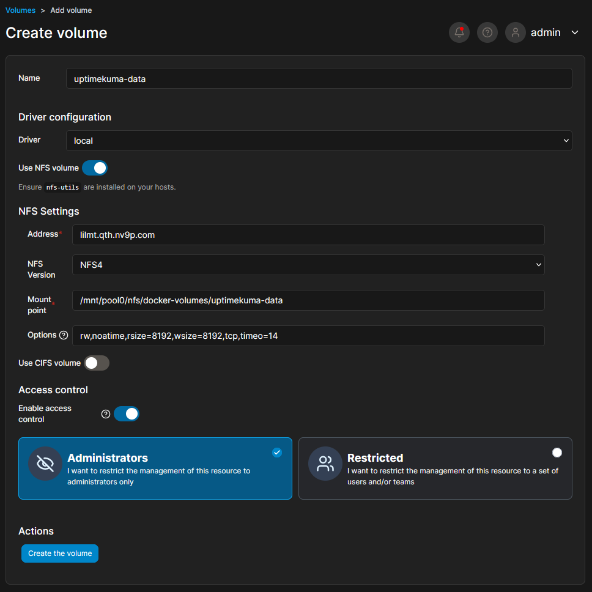
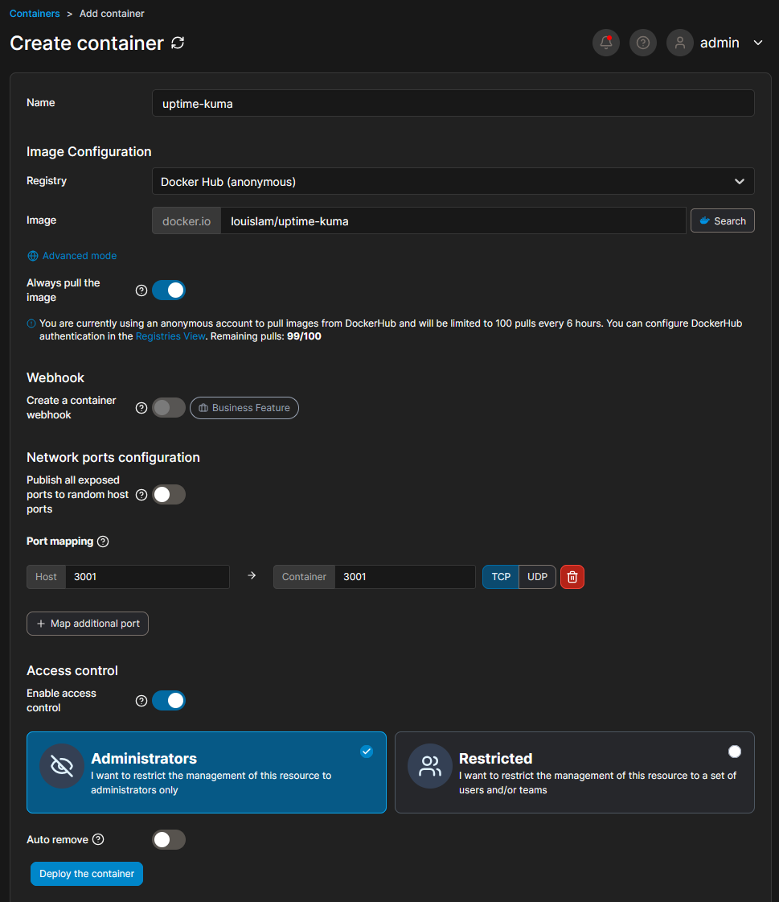
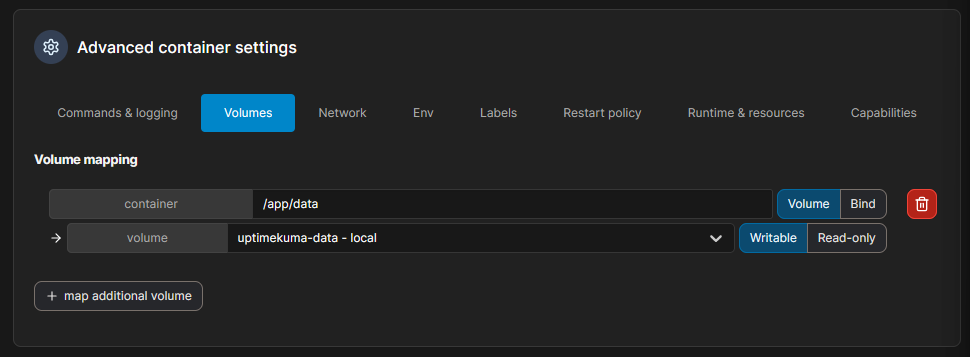
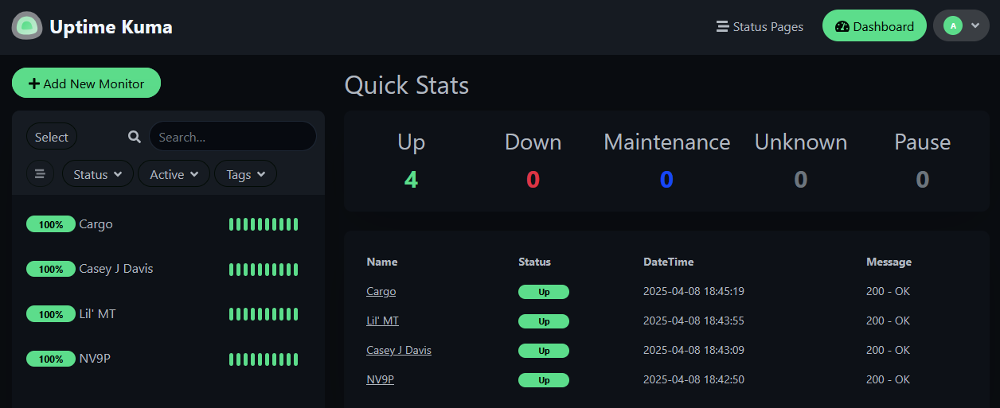

## Introduction

In this guide, I’ll walk you through setting up Uptime Kuma, a self-hosted monitoring tool, in a Docker container using NFSv4 for persistent storage. This setup is part of my homelab, where I experiment with containerization and various technologies.

## Prerequisites

Before starting, ensure you have the following:

- **NFS Server**: I’m using TrueNAS on an HP EliteDesk.
- **Docker Host**: My Docker server runs on a separate HP EliteDesk.

## Step 1: Export an NFS Share

Begin by exporting an NFS share from your NFS server. In my case, I exported the directory `/mnt/pool0/nfs/docker-volumes` from TrueNAS. 

Next, SSH into your Docker server and mount the NFS share. For example:

```bash
sudo mount -t nfs4 lilmt.qth.nv9p.com:/mnt/pool0/nfs/docker-volumes /mnt/nfs
```

Once mounted, create a directory for Uptime Kuma’s persistent data:

```bash
mkdir -p /mnt/nfs/uptimekuma-data
```

This directory will store all the container’s data.

## Step 2: Create a Volume in Portainer

I use Portainer to manage my Docker containers. To create a volume:

1. Access the Portainer web interface.
2. Navigate to **Volumes** and click **Add Volume**.
3. Fill in the NFS server details, including the mount point (`/mnt/nfs/uptimekuma-data`), and click **Create the volume**.



## Step 3: Deploy the Uptime Kuma Container

Now, create the Uptime Kuma container:

1. Go to the **Containers** section in Portainer and click **Add Container**.
2. Name the container and use the official Uptime Kuma image: `louislam/uptime-kuma`.
3. Under **Network**, map port `3000` on both the host and container.
4. Scroll to the **Volumes** section and map the NFS volume:
    - Set the container path to `/app/data`.
    - Select the NFS volume created earlier.

Finally, click **Deploy the container**.





## Step 4: Access Uptime Kuma

Once the container is running, navigate to your Docker server’s IP address on port `3000` to access Uptime Kuma. For example:

```
http://docker-01.qth.nv9p.com:3000
```

You should see the Uptime Kuma interface, ready for configuration.



## Conclusion

By leveraging NFSv4 for persistent storage, you can efficiently manage Uptime Kuma in a Docker container. This setup ensures data persistence and simplifies container management using Portainer. Happy monitoring!