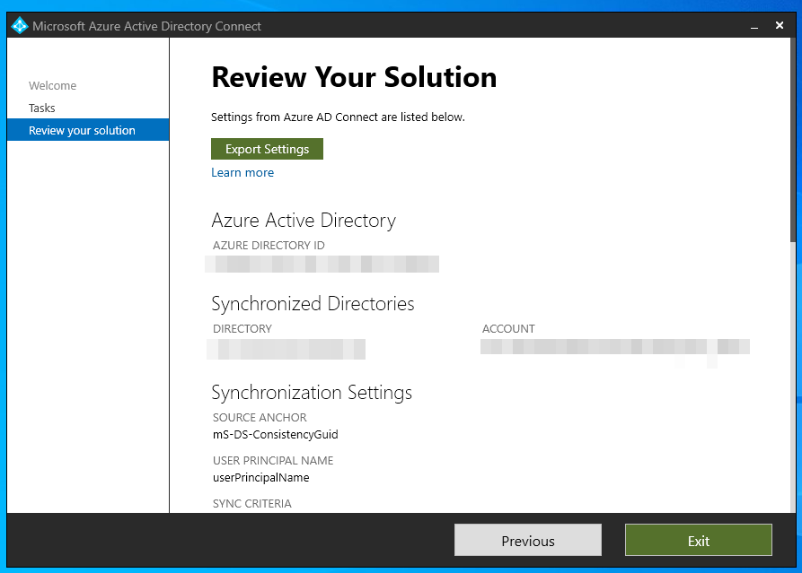
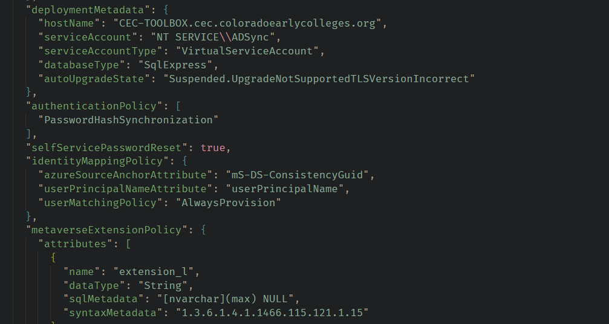
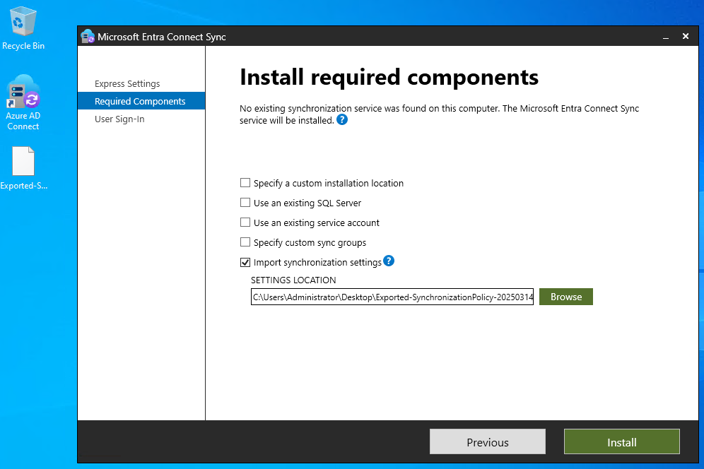

## Intro

If you are a Microsoft Entra user, they are encouraging upgrading Azure Active Directory Connect customers to migrate to Microsoft Entra Connect. Here are some steps to help migrate your existing configuration.

## In-Place Upgrade or Swing Migration?

After some careful consideration I settled on a Swing Migration to give me the most flexibility and backup in case something went wrong. Here's how Microsoft explains it:


> For some customers, an in-place upgrade can impose a considerable risk to production in case there's an issue while upgrading and the server can't be rolled back. A single production server might also be impractical as the initial sync cycle might take multiple days, and during this time, no delta changes are processed.

> The recommended method for these scenarios is to use a swing migration. You can use this method when you need to upgrade the Windows Server operating system. Additionally, you can use it when you plan to make substantial changes to your environment configuration, which need to be tested before they're pushed to production.

## Backup Existing Configuration

Open Azure AD Connect on your existing server and you can export your working config for the second swing server



If you are using a fairly recent version of AD Connect it will export in JSON



## Configuring TLS 1.2

Setup a new Windows server VM where you will install Entra Connect. Before you can successfully install the application you must configure TLS on your server. Open Powershell ISE as Administrator and run this code on the swing server. This is writing 8 new entries to the Registry enabling TLS 1.2

```powershell
If (-Not (Test-Path 'HKLM:\SOFTWARE\WOW6432Node\Microsoft\.NETFramework\v4.0.30319'))
{
    New-Item 'HKLM:\SOFTWARE\WOW6432Node\Microsoft\.NETFramework\v4.0.30319' -Force | Out-Null
}
New-ItemProperty -Path 'HKLM:\SOFTWARE\WOW6432Node\Microsoft\.NETFramework\v4.0.30319' -Name 'SystemDefaultTlsVersions' -Value '1' -PropertyType 'DWord' -Force | Out-Null
New-ItemProperty -Path 'HKLM:\SOFTWARE\WOW6432Node\Microsoft\.NETFramework\v4.0.30319' -Name 'SchUseStrongCrypto' -Value '1' -PropertyType 'DWord' -Force | Out-Null

If (-Not (Test-Path 'HKLM:\SOFTWARE\Microsoft\.NETFramework\v4.0.30319'))
{
    New-Item 'HKLM:\SOFTWARE\Microsoft\.NETFramework\v4.0.30319' -Force | Out-Null
}
New-ItemProperty -Path 'HKLM:\SOFTWARE\Microsoft\.NETFramework\v4.0.30319' -Name 'SystemDefaultTlsVersions' -Value '1' -PropertyType 'DWord' -Force | Out-Null
New-ItemProperty -Path 'HKLM:\SOFTWARE\Microsoft\.NETFramework\v4.0.30319' -Name 'SchUseStrongCrypto' -Value '1' -PropertyType 'DWord' -Force | Out-Null

If (-Not (Test-Path 'HKLM:\SYSTEM\CurrentControlSet\Control\SecurityProviders\SCHANNEL\Protocols\TLS 1.2\Server'))
{
    New-Item 'HKLM:\SYSTEM\CurrentControlSet\Control\SecurityProviders\SCHANNEL\Protocols\TLS 1.2\Server' -Force | Out-Null
}
New-ItemProperty -Path 'HKLM:\SYSTEM\CurrentControlSet\Control\SecurityProviders\SCHANNEL\Protocols\TLS 1.2\Server' -Name 'Enabled' -Value '1' -PropertyType 'DWord' -Force | Out-Null
New-ItemProperty -Path 'HKLM:\SYSTEM\CurrentControlSet\Control\SecurityProviders\SCHANNEL\Protocols\TLS 1.2\Server' -Name 'DisabledByDefault' -Value '0' -PropertyType 'DWord' -Force | Out-Null

If (-Not (Test-Path 'HKLM:\SYSTEM\CurrentControlSet\Control\SecurityProviders\SCHANNEL\Protocols\TLS 1.2\Client'))
{
    New-Item 'HKLM:\SYSTEM\CurrentControlSet\Control\SecurityProviders\SCHANNEL\Protocols\TLS 1.2\Client' -Force | Out-Null
}
New-ItemProperty -Path 'HKLM:\SYSTEM\CurrentControlSet\Control\SecurityProviders\SCHANNEL\Protocols\TLS 1.2\Client' -Name 'Enabled' -Value '1' -PropertyType 'DWord' -Force | Out-Null
New-ItemProperty -Path 'HKLM:\SYSTEM\CurrentControlSet\Control\SecurityProviders\SCHANNEL\Protocols\TLS 1.2\Client' -Name 'DisabledByDefault' -Value '0' -PropertyType 'DWord' -Force | Out-Null

Write-Host 'TLS 1.2 has been enabled. You must restart the Windows Server for the changes to take affect.' -ForegroundColor Cyan
```

## Importing Configuration

After TLS has been enabled, install the software and launch the executible. Walk through the wizard and you will reach a point where you can import your existing config



## Stick around for Part 2

We will finish configuring Microsoft Entra Connect and performing a synchronization of user data.