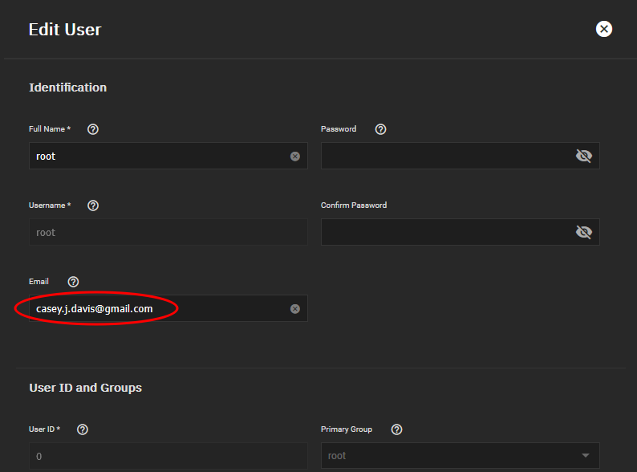
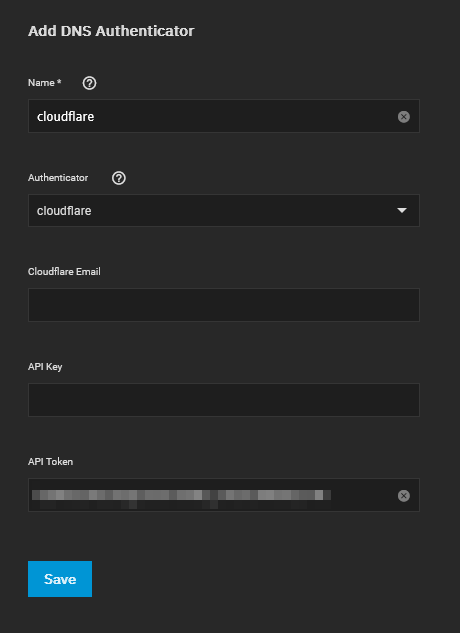
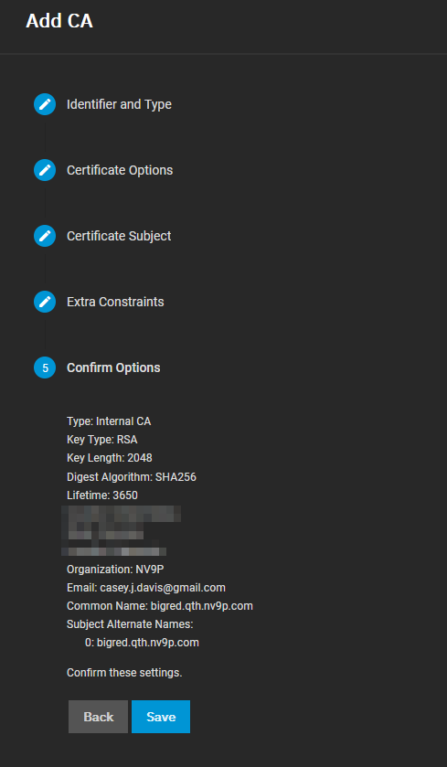
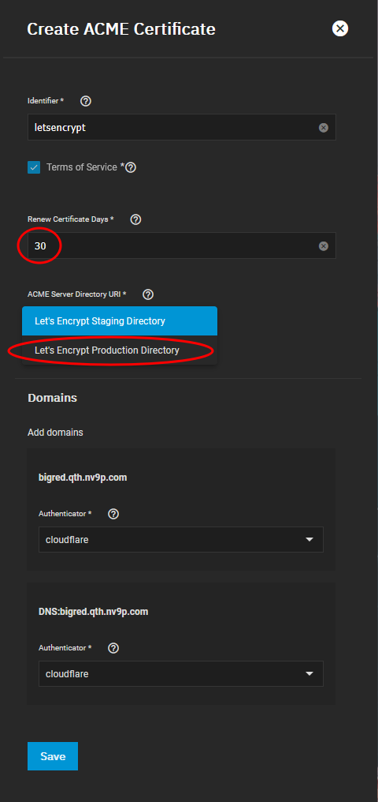
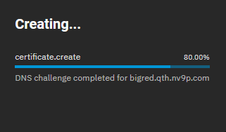
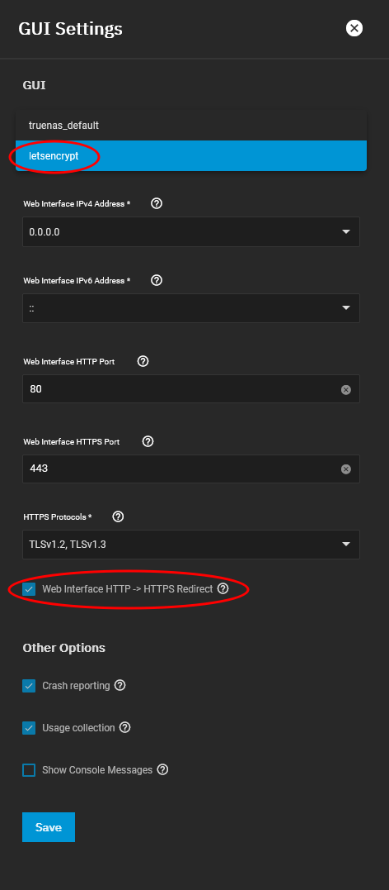
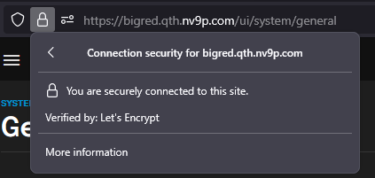

## Introduction

TrueNAS includes a built-in ACME DNS authenticator accessible through its web interface, enabling seamless generation of SSL certificates for the administrative portal. This guide outlines the steps to configure Cloudflare as an authenticator with Let's Encrypt for automated SSL certificate management in TrueNAS.

## Update User Information

Begin by updating a user account on your TrueNAS system with a valid email address. In this example, the root user is updated with an email address, which is a prerequisite for generating a certificate.

## Configure ACME DNS Authenticator

Next, configure a DNS authenticator. This guide uses Cloudflare as the DNS provider. Generate an API token with permissions to edit DNS zones, then name the authenticator and input the token in the API Token field. Note: If using an API token, you do not need to provide your Cloudflare email or API key.

## Create a Certificate Signing Request (CSR)

Provide the necessary details for the Certificate Signing Request (CSR) to populate the certificate's information. Complete the required fields and save the CSR.

After generating the CSR, click the wrench icon 🔧 in the web interface to open the wizard for certificate generation.

## Generate the SSL Certificate

For the identifier, use `letsencrypt`, accept the Terms of Service, and set the certificate to renew every 30 days (recommended for home lab environments). Select "Production Directory," choose the domain, assign the authenticator, and save the configuration.

A progress pop-up will display the status of the certificate provisioning. A successful DNS challenge will appear as shown below.

## Activate the New Certificate

Once the SSL certificate is generated, configure the TrueNAS web interface to use it. Navigate to System Settings > General > GUI > Settings. Select the new certificate from the dropdown menu, enable the "HTTP > HTTPS Redirect" option, and save the changes. The web interface will restart to apply the new settings.

## Verify the SSL Certificate

To confirm the certificate is active, click the lock icon in your browser's address bar. Verify that the certificate is issued by Let's Encrypt.

