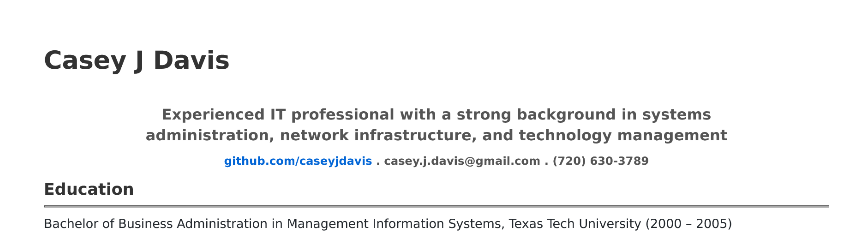
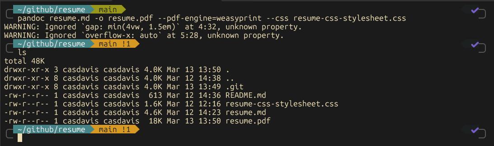

import MdxPublicImage from "@/components/MdxPublicImage.astro";

## Intro

I needed to generate current resume and wanted to use Markdown to keep it simple and version controlled. I found several examples online and decided to create my own version. This project uses pandoc to convert a markdown file to a pdf file. I also used weasyprint to add a css stylesheet to the pdf file. This is an example of how pandoc styled the file using a custom css stylesheet:



## Requirements

I run an instance of Ubuntu 24.04 in Windows Subsystem for Linux (WSL) and used the following packages:

- pandoc
- weasyprint

## Installation

Install requirements, I was able to do this easily in Ubuntu with the following commands:

```bash
sudo apt install pandoc weasyprint -y
```
Then clone this repository to your local machine
```bash
git clone https://github.com/caseyjdavis/resume.git
```
## Customization

Edit the resume.md file to include your information. You can also edit the resume-css-stylesheet.css file to change the styling of the pdf file. The beauty of this project is that you can easily version control your resume and make changes as needed.

## Output

Once you are happy with your resume, run the following command to generate the pdf file:

```bash
pandoc resume.md -o resume.pdf --pdf-engine=weasyprint --css resume-css-stylesheet.css
```

## Finished product

Pandoc will export a finished resume.pdf file in the current folder

