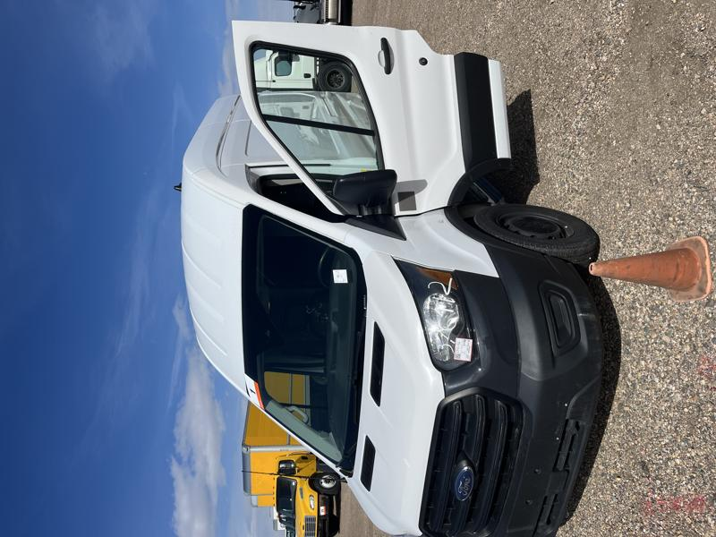

import Callout from "@components/Callout.astro";

## Intro

This is my 2020 Ford Transit I purchased used at auction in northern Colorado. It was a Penske truck in its previous life. The van was a little scraped and dinged up but otherwise in fine shape considering its age. It was fleet maintained so there was always regularly scheduled oil changes and a new pair of front brake pads before I became the owner.

## Before

## After

<Callout type="error">
Why yes, that IS a Jimmy Buffet Margaritaville Maker running off an extension cord from deep within the van.
</Callout>

## Vango Buildout Website

I created a website to document the buildout of the van. You can view it below.
[Vincent Vango Build Page](https://caseyjdavis.github.io/vango/)