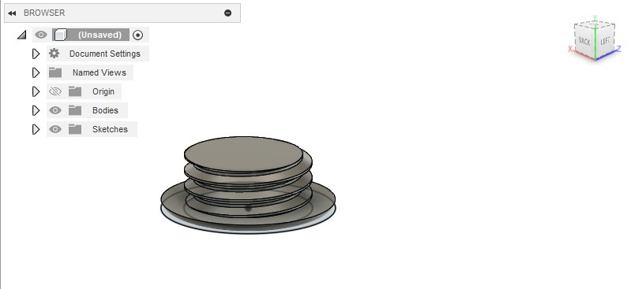
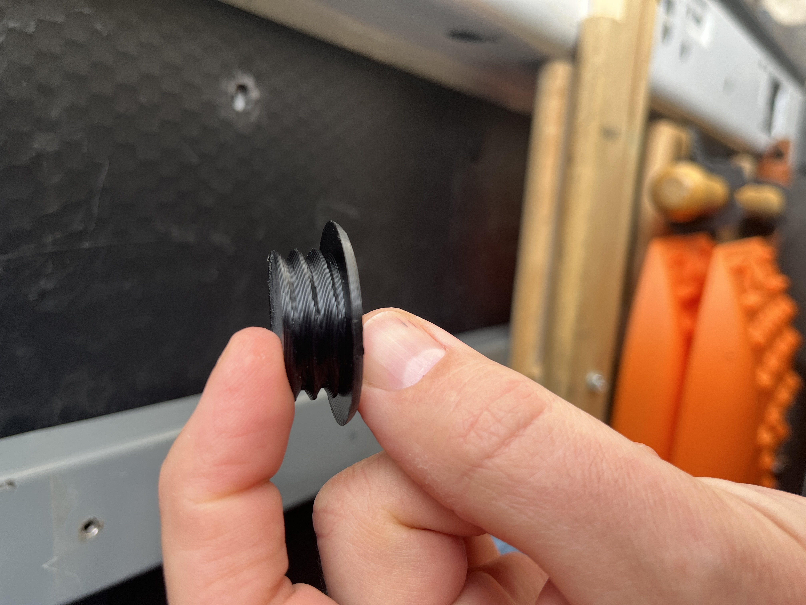
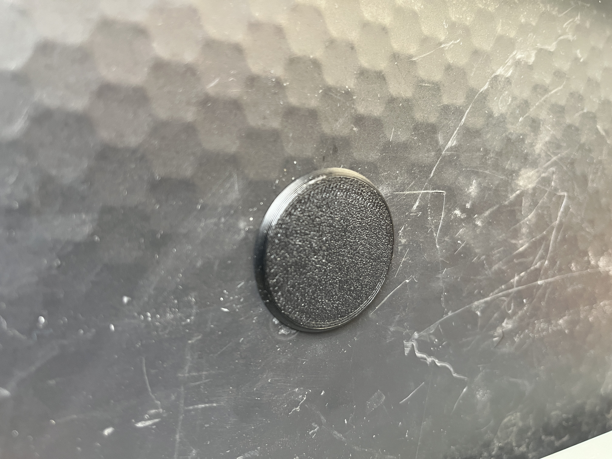

I had accidentally drilled a hole in the incorrect panel in my van so I whipped up a quick plug in Fusion 360. I used the threads tool in Fusion to give a little grip.

Finished product. Came out really nice in PETG HF black plastic in my Bambu X1 Carbon 3D printer.

Problem solved.

